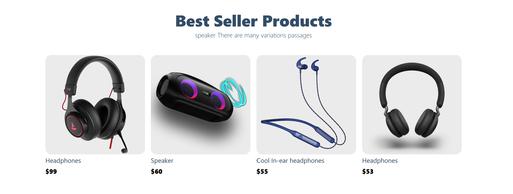
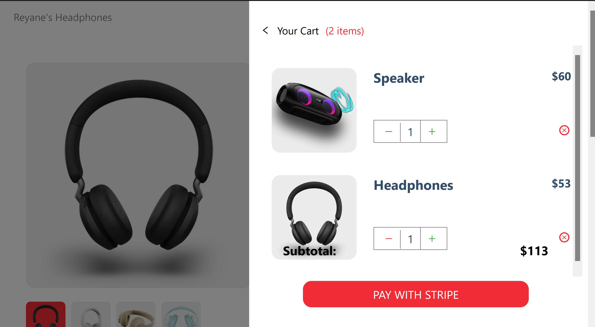

# Eshop

A fully responsive Modern Full Stack Ecommerce application with Payments functionality. With Modern design, animations, the ability to add and edit products on the go using a CMS, all advanced cart functionalities, and most importantly the complete integration with Stripe so that  REAL payments can be used

## Next.js

File-based routing, Data fetching that allows server-side rendering and static generation which makes your websites incredibly optimized (show getServerSideProps, getStaticPaths, getStaticProps), and the ability to use the same code for both the client and server.

## Images

